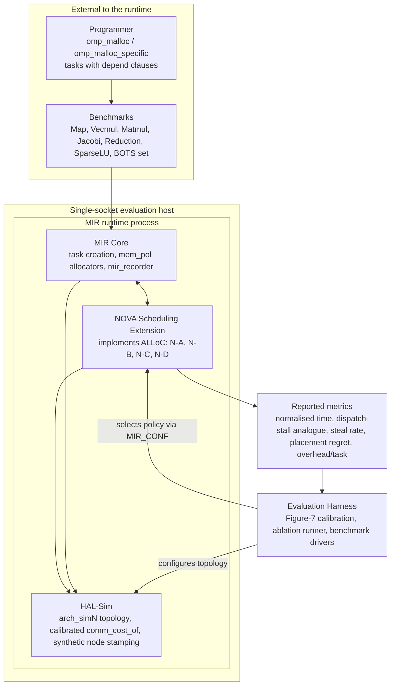
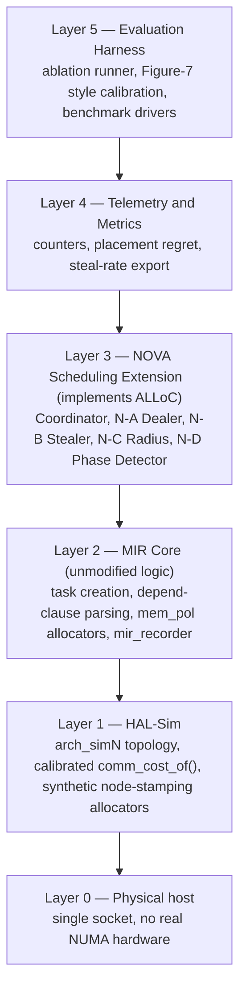
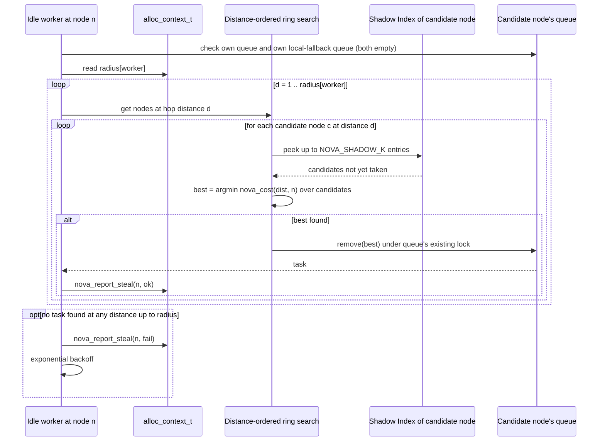
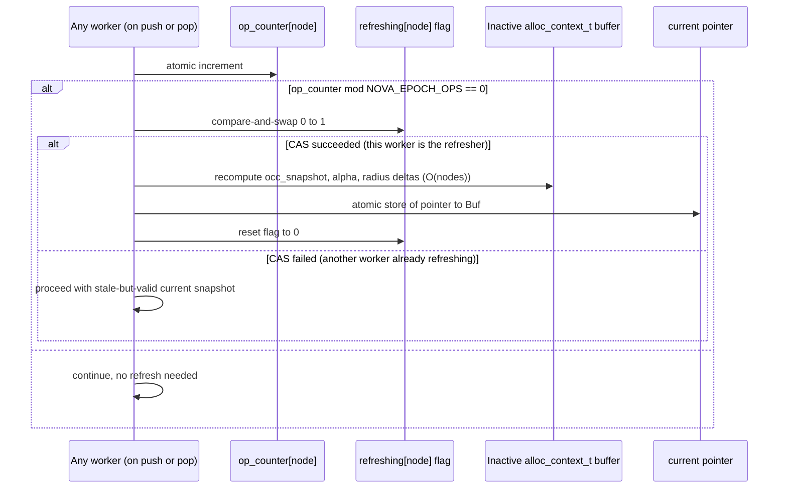
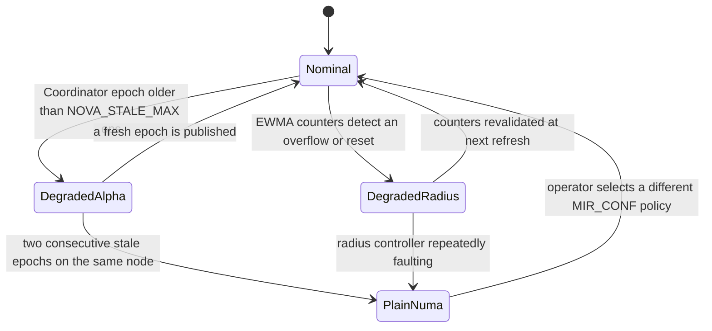
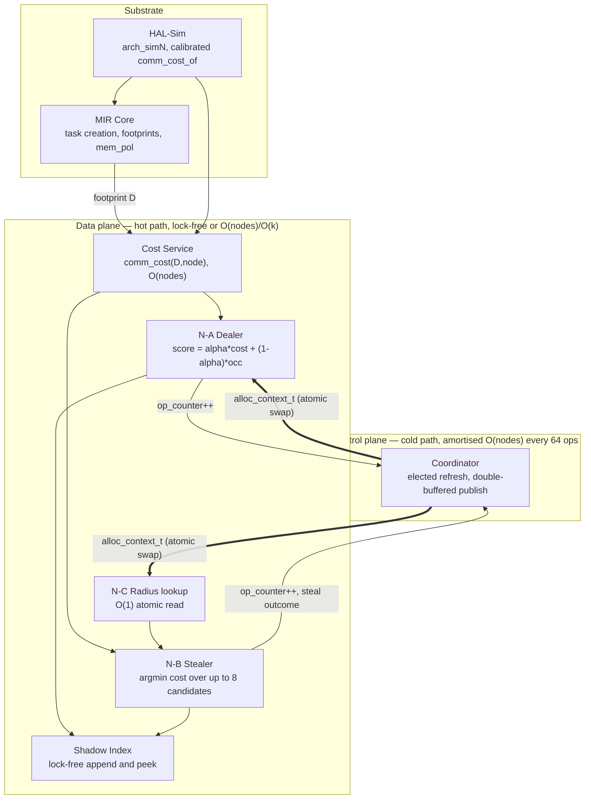

# NOVA — Architecture Specification

**NOVA** (**N**UMA-**O**ptimized, **V**icinity-**A**daptive scheduler) is our implementation of the
**ALLoC** policy (Adaptive Locality–Load Co-Scheduling, defined in
[`06-novelties-alloc.md`](06-novelties-alloc.md)) as a concrete extension to the MIR runtime. That
earlier document specified *what* ALLoC does (N-A/B/C/D) and *why*, at the algorithm level. **This
document specifies how it is built** — the components, the data structures, the concurrency model, the
failure modes, and the exact files touched in `anamud/mir-dev` — at the level a systems reviewer needs
to sign off on before code is written.

This is a from-scratch systems design, not a restatement: it introduces a **control-plane / data-plane
split** that none of the prior documents specify, a **Shadow Index** structure that makes task-level
stealing (N-B) implementable without breaking queue invariants, and an explicit **overhead budget** and
**degradation ladder** so that fixing the base paper's locality bugs cannot itself introduce a new
scheduling bottleneck.

---

## Table of contents

- [0. Relationship to prior documents](#0-relationship-to-prior-documents)
- [1. Goals, non-goals, design principles](#1-goals-non-goals-design-principles)
- [2. System context](#2-system-context)
- [3. Layered architecture](#3-layered-architecture)
- [4. Component catalogue](#4-component-catalogue)
- [5. Data structures](#5-data-structures)
- [6. Sequence diagrams](#6-sequence-diagrams)
- [7. Concurrency & consistency model](#7-concurrency--consistency-model)
- [8. Complexity / overhead budget](#8-complexity--overhead-budget)
- [9. Configuration surface & ablation matrix](#9-configuration-surface--ablation-matrix)
- [10. Failure modes & graceful degradation](#10-failure-modes--graceful-degradation)
- [11. Hotspot traceability matrix](#11-hotspot-traceability-matrix)
- [12. Codebase layout](#12-codebase-layout)
- [13. Fit into the evaluation methodology](#13-fit-into-the-evaluation-methodology)
- [14. Architecture-specific risks](#14-architecture-specific-risks)
- [15. Glossary additions](#15-glossary-additions)
- [16. NOVA at a glance](#16-nova-at-a-glance)

---

## 0. Relationship to prior documents

| Document | Provides | This document |
|---|---|---|
| [`04-hotspots.md`](04-hotspots.md) | *What* is wrong (H1–H7) | Names which component fixes each one (§11) |
| [`05-implementation-defects.md`](05-implementation-defects.md) | *Where* the code is wrong (D1–D3) | Names which component absorbs each fix (§11) |
| [`06-novelties-alloc.md`](06-novelties-alloc.md) | *What* to do about it (N-A/B/C/D, algorithm level) | *How* to build it (components, structs, concurrency) |
| [`07-evaluation-plan.md`](07-evaluation-plan.md) | The single-socket real/modelled evaluation methodology | The HAL-Sim layer (§4.1) that this architecture must expose to satisfy that methodology |
| [`03-mir-codebase-mapping.md`](03-mir-codebase-mapping.md) | The existing MIR file map | The new/modified file map for NOVA (§12) |

Read those first if any term below is unfamiliar; this document does not re-derive background covered
in [`00-study-guide.md`](00-study-guide.md).

---

## 1. Goals, non-goals, design principles

### 1.1 Goals

- Beat the base paper on **both** of its own metrics — normalised critical-path execution time and
  aggregate dispatch-stall cycles — on the reproduced benchmark set (Table 4 of the paper).
- Do this **within the single-socket + HAL-Sim constraint** already locked in for evaluation
  ([`07-evaluation-plan.md`](07-evaluation-plan.md)).
- Leave the **programmer-facing interface unchanged**: `omp_malloc` / `omp_malloc_specific`,
  `depend`-clause-derived footprints. NOVA is a runtime-internal change only.
- Make every mechanism **independently ablatable** so the evaluation can report
  `baseline → +N-A → +N-A+N-B → +N-A+N-B+N-C` as a clean additive study.

### 1.2 Non-goals

- Real multi-socket NUMA deployment (excluded by the hardware constraint; HAL-Sim substitutes for it).
- Redesigning the `fine` / `coarse` data-distribution policies themselves (H7's "third policy" stays
  optional/secondary — see the Heuristic Feedback Log in §4.9, which is a diagnostic, not a new
  policy).
- A source-to-source OpenMP front end. MIR has none; benchmarks are written against its API, exactly
  as in the base paper (§5 of [`00-study-guide.md`](00-study-guide.md)).
- Landing N-D (§4.7) or the Heuristic Feedback Log (§4.9) unconditionally — both are explicitly
  stretch, gated on time and on evidence from N-A/B/C results.

### 1.3 Design principles

These four rules are the actual novelty in this document — they are what keeps "add three smarter
heuristics" from silently turning into "add three new bottlenecks."

1. **Never fix a locality bug with a new contention bug.** The base paper's hotspots are about
   *decisions*, not about *synchronisation*. If NOVA's smarter decisions require a global lock on every
   push/pop, we will have replaced H3 (load-blind dealing) with a new, worse bottleneck: lock
   contention on every task. **Every read NOVA needs on the hot path must be lock-free and O(1) or
   O(nodes)**, achieved by moving statistics computation to a slow control plane (§4.2) that publishes
   immutable snapshots to a fast data plane (§4.3–4.5).
2. **Additive, not invasive.** NOVA is a new scheduling policy registered alongside `numa`,
   `ws-de-node`, and `central` (§12) — it never edits their logic. Rolling back to the paper's own
   locality-aware scheduler, or to plain work-stealing, is a one-line `MIR_CONF` change, never a
   revert.
3. **Every added mechanism has a documented, tested fallback.** The base paper's own safety claim is
   that its scheduler "falls back to work-stealing when locality is missing" (§6.7,
   [`00-study-guide.md`](00-study-guide.md)). NOVA extends that promise to its *own* machinery: if the
   Coordinator's data goes stale, if the Shadow Index is empty, if the Radius Controller misbehaves,
   NOVA degrades to well-defined, previously-measured behaviour — never to a hang, a crash, or silent
   incorrect scheduling (§10).
4. **Overhead is budgeted before it is measured.** Each component states its worst-case cost in §8
   *before* any implementation exists, mirroring the discipline the base paper itself uses when it
   states its cost model is `O(N²)` (§3.4, [`00-study-guide.md`](00-study-guide.md)) — so we know
   exactly what we are paying for what we get.

---

## 2. System context



**Reading this diagram.** NOVA sits *inside* the MIR process, as a peer of the existing `numa` and
`ws-de-node` policies — it is not a separate service. HAL-Sim is what makes the whole picture valid on
a single socket: it is the only component aware that the "8 NUMA nodes" the scheduler reasons about
are simulated (§4.1). The harness outside the process is what turns individual runs into the
reproduction table and the ablation study required by §7 of
[`07-evaluation-plan.md`](07-evaluation-plan.md).

---

## 3. Layered architecture



Each layer only depends on the one below it, with one deliberate exception: **Layer 3 reads footprint
data that Layer 2 already computes** (the `mir_mem_node_dist_t` per task, described in
[`03-mir-codebase-mapping.md`](03-mir-codebase-mapping.md) §"Key data structures") rather than
recomputing it — NOVA is a *consumer* of MIR's existing footprint machinery, never a second
implementation of it. This keeps D1/D2 (§11) as single-point fixes shared by both the `numa` policy and
NOVA, instead of forked, divergent copies.

---

## 4. Component catalogue

### 4.1 HAL-Sim — Hardware Abstraction Layer, Simulated

**Responsibility.** Make the single-socket host present an `N`-node topology to the scheduler, with a
calibrated cost function, so that every decision NOVA makes is a *real* decision even though the
underlying hardware is not really NUMA. This is the component that carries the entire methodology of
[`07-evaluation-plan.md`](07-evaluation-plan.md) §7.1.

**Consists of:**

- **`arch_simN`** — a new arch model (peer of `mir_arch_firenze.c`, `_gothmog.c`, `_tilepro64.c`)
  defining `num_nodes = N`, `node_of()`, `vicinity_of()`, `diameter`, `llc_size_KB`, and a
  `comm_cost_of(i, j)` matrix calibrated to the paper's Figure 2 measurements (local ≈ 40 cycles,
  remote ≈ 240–340 cycles; §7.2 of [`07-evaluation-plan.md`](07-evaluation-plan.md)).
- **Synthetic node-stamping allocators** — thin wrappers around `allocate_coarse` / `allocate_local` /
  `allocate_fine` in `mir_mem_pol.c` that stamp `mem_header_t.nodeid` (or a synthetic `node_cache[]`
  for `fine`) using `arch_simN`'s round-robin counter, instead of calling `numa_alloc_onnode()` /
  `get_mempolicy()`. Gated by a new `MIR_ARCH_SIMULATED` compile flag so the real NUMA path is untouched
  when building for actual hardware.

**Interface exposed upward.** Identical to every other arch model — `comm_cost_of()`, `node_of()`,
`vicinity_of()`, `diameter`. **NOVA does not know it is talking to a simulation.** This is intentional:
it means every line of NOVA's decision logic is exercised exactly as it would be on real hardware, and
porting NOVA to a real NUMA box later is a matter of swapping the arch model, not touching NOVA.

### 4.2 Coordinator — the control plane

**Responsibility.** Compute the *slow-changing* statistics that N-A and N-C need (queue occupancy
snapshot, steal-rate EWMAs, the blend weight `α`, per-worker radius) **off the hot path**, and publish
them as a single immutable snapshot that readers consume without locking.

**Why this exists (the core novelty of this document).** Without it, a naive N-A would call
`mir_queue_size()` on every candidate node on every significant task push, and a naive N-C would
recompute an EWMA under a shared lock on every steal attempt. Both are exactly the kind of *new*
synchronisation point that principle 1 (§1.3) forbids. The Coordinator amortises this: it recomputes
once per **epoch** (a configurable number of push/pop operations, default 64 per node) instead of once
per operation.

**Election, not a dedicated thread.** MIR pins one thread per core (§4 of
[`00-study-guide.md`](00-study-guide.md)); NOVA must not steal a core for a management thread. Instead,
each node keeps an atomic `op_counter`. Whichever worker's increment makes
`op_counter mod EPOCH == 0` becomes that epoch's refresher — a compare-and-swap on a small
`refreshing` flag prevents two workers from refreshing the same epoch under a race at the boundary.
The refresher does the `O(nodes)` recomputation, writes it into the *inactive* buffer of the
double-buffered `alloc_context_t` (§5.1), then does one atomic pointer swap. Every other worker pays
nothing beyond the counter increment it already had to do.

**Consumers.** N-A Dealer (§4.3, reads `alpha` and `occ_snapshot`), N-C Radius Controller (§4.5, reads
and writes `steal_fail_ewma` / `steal_ok_ewma` and derives `radius[]`).

### 4.3 N-A — Load-Aware Dealer

**Responsibility.** Replace `push_numa()`'s pure `argmin` communication cost with the blended score
defined in [`06-novelties-alloc.md`](06-novelties-alloc.md) N-A:

```
score(q) = alpha * cost_norm(D, q) + (1 - alpha) * occ_norm(q)
```

**What changes vs. the base paper's `push_numa()`.** `cost_norm` and `occ_norm` are both computed by
iterating nodes directly (fixing D2 — see §11), not workers. `occ_norm` is read from the Coordinator's
last-published snapshot (§4.2), not queried live. The `StdDev(D) > 0` gate is dropped entirely (it was
broken anyway — D1); the `sum(D) > LLC/C` gate is kept, because principle 1 says: don't spend the
`O(nodes)` score computation on tasks that will hit their cache regardless.

**Interface.** `nova_deal(task, this_worker) -> queue_id`. Called from the same call site that
currently calls `push_numa()`.

### 4.4 N-B — Locality-Aware Stealer

**Responsibility.** When an idle worker has picked a victim *queue*, choose the best *task* within it
by locality rather than simply taking the queue's steal-end entry, per
[`06-novelties-alloc.md`](06-novelties-alloc.md) N-B.

**The concrete problem this component solves.** The base paper's queues on the NUMA scheduling path
(`mir_task_queue_t` / `mir_queue_t`, used by `mir_sched_pol_numa.c` — distinct from the lock-free
Chase–Lev deque used only by the `ws_de*` baselines) do not expose an operation to inspect the `k`
oldest entries and remove an arbitrary one of them safely under concurrent steals. **N-B does not
reimplement or subvert that queue.** It is paired with a small side structure, the **Shadow Index**
(§4.4.1), that gives it exactly the visibility it needs without adding a new lock class to the queue
itself.

#### 4.4.1 Shadow Index

A fixed-capacity ring buffer, one per per-node task queue, holding `{task pointer, cached footprint
distribution, generation}` for the most recent `k` tasks pushed to that queue (default `k = 8`).

- **Append is lock-free and single-writer.** Only the *owning* node's dealer appends to a node's
  Shadow Index, at the same point it pushes the task to the real queue — this matches MIR's existing
  invariant that only local dealing pushes to a node's queue, so there is never a concurrent-append
  race to design around.
- **Peek is lock-free and multi-reader.** Any idle worker considering this node as a steal target may
  read all `k` entries without taking any lock, because entries are append-only and never mutated in
  place.
- **Removal is the only locked operation**, and it reuses the *same* lock the underlying
  `mir_task_queue_t` already takes to remove an entry for a steal — so N-B introduces **zero new lock
  classes**, only one new critical section shape (validate-then-remove instead of
  remove-from-the-end).
- **Staleness safety.** Before selecting a candidate, the stealer checks the task's existing `taken`
  flag (already present in `struct mir_task_t`, used by every scheduler to guard against double-steal —
  see [`03-mir-codebase-mapping.md`](03-mir-codebase-mapping.md)). A candidate whose `taken` flag is
  already set is skipped, not dereferenced further. This is the only correctness-critical check N-B
  adds.

**Interface.** `nova_steal_best(queue, thief_node) -> task_or_null`. Internally: peek up to `k` Shadow
Index entries for `queue`, filter out `taken` tasks, compute `comm_cost(D, thief_node)` for the rest
using the already-cached `dist_by_access_type[READ]` on each task (zero new computation of footprints —
see §4.6), pick the minimum, then perform the actual removal under the queue's existing lock.

### 4.5 N-C — Adaptive Radius Controller

**Responsibility.** Give every worker a per-worker steal radius `r` that grows under sustained steal
failure and shrinks under success, replacing the base paper's static vicinity / fixed
`cores_per_node × d` threshold (H1), per [`06-novelties-alloc.md`](06-novelties-alloc.md) N-C.

**Mechanism.** The Coordinator (§4.2) maintains `steal_fail_ewma[node]` and `steal_ok_ewma[node]`,
updated by whichever worker just attempted a steal (an O(1) EWMA update, not a lock — see §7). At each
epoch refresh, the Coordinator derives each worker's new radius:

```
if steal_fail_ewma[node] > FAIL_HIGH:  radius[node] = min(radius[node] + 1, arch->diameter)
if steal_ok_ewma[node]   > OK_HIGH:    radius[node] = max(radius[node] - 1, 1)
```

with `FAIL_HIGH` and `OK_HIGH` set so that the two conditions cannot both fire in the same epoch
(hysteresis, per the risk noted in [`06-novelties-alloc.md`](06-novelties-alloc.md)), and radius
changes are capped at one step per epoch (the rate cap).

**Folding in D3.** The base paper's `pop_numa()` step 3 — an unordered, unguarded linear scan of every
other node's `alt_queue` — is *replaced*, not supplemented: NOVA's ring search visits nodes in
distance order out to the current radius and includes each node's alt-queue-equivalent entries in that
same ordered walk, so the "insignificant footprint" task population NOVA still parks locally is
searched with the same distance discipline as everything else.

**Interface.** `nova_radius(worker) -> uint32_t`, read by the ring-search loop that drives N-B's search
order; `nova_report_steal(node, ok_or_fail)`, called once per steal attempt.

### 4.6 Footprint & Cost Service

**Responsibility.** The one shared implementation of "how much would it cost node `i` to run this
footprint," used by both N-A and N-B, and by the corrected significance gate. This is the single place
D1 and D2 are fixed.

- **D1 fix.** `mir_mem_node_dist_get_stat()`'s variance loop is corrected to accumulate
  (`sum_dsq += diff*diff`) rather than overwrite. Documented as a behaviour change: this makes the
  (now-removed-from-N-A, but still relevant for any code path that still checks it) `StdDev(D) > 0`
  gate reflect the true spread rather than one node's deviation.
- **D2 fix.** The candidate-cost loop iterates `arch->num_nodes` directly, not `runtime->num_workers`
  with node-change detection. `O(nodes)` per call, matching the paper's own stated complexity, and no
  longer fragile to non-contiguous worker-to-node layouts.
- **No new cost model.** The weighted-sum formula itself —
  `cost(i) = Σ_j D[j] × comm_cost_of(i, j)` — is unchanged from Algorithm 1
  (§3.4, [`00-study-guide.md`](00-study-guide.md)). NOVA's novelty is in *what the score does with*
  this cost (blended with load in N-A, compared across a handful of tasks in N-B), not in the cost
  formula itself.

**Interface.** `nova_cost(dist, node) -> uint64_t` (thin wrapper over the corrected
`mir_mem_node_dist_get_comm_cost`), `nova_is_significant(dist) -> bool` (the corrected, D1/D2-free gate
using only the `sum(D) > LLC/C` threshold).

### 4.7 N-D — Phase Detector & Redistribution Hint *(stretch)*

**Responsibility.** Close the feedback loop the base paper is missing (H6): detect when the same task
DAG shape repeats across barriers (an iterative kernel — Jacobi, Reduction), and after the first
iteration, hint a bounded re-homing of pages that were consistently accessed from a node other than
their allocation-time home.

**Mechanism sketch.**

- A lightweight structural hash of the DAG shape (task count, dependence pattern) computed once per
  barrier; two consecutive equal hashes flag a "phase."
- Once a phase is detected, the Coordinator additionally accumulates, per allocation site, which node
  actually *executed* the tasks touching each page (available from the recorder's existing
  `exec_end_instant` / worker-node mapping).
- If a page's realised access node disagrees with its allocated node for more than a threshold fraction
  of a phase's iterations, it is queued for a **budgeted** re-home (a bounded number of pages per
  phase, using `numa_move_pages()` on real hardware or the equivalent synthetic re-stamp under HAL-Sim).

**Explicitly scoped as stretch.** N-D is architected here so that N-A/B/C do not have to be redesigned
if it lands later, but it is not on the critical path to the evaluation's success criterion
(§7.5, [`07-evaluation-plan.md`](07-evaluation-plan.md)). It is only implemented if Jacobi/Reduction
show clear residual remote traffic after N-A/B/C.

### 4.8 Heuristic Feedback Log *(stretch, secondary contribution)*

**Responsibility.** A diagnostic, not a scheduling mechanism: log, per allocation site, the Dealer's
*predicted* cost at dealing time against the task's *observed* `comm_cost` after execution
(`regret_sample_t`, §5.3). Aggregated at the end of a run, this produces direct evidence for whether the
Table 3 heuristic (base paper §3.4) picked the right policy for that allocation — the exact question
raised by H7 (SparseLU's "needs a scheme more advanced than fine and coarse").

This does **not** propose a new distribution policy; it produces the *evidence* that would justify one,
as an optional secondary contribution if time permits. It consumes data the Dealer already computes
(zero additional hot-path cost beyond appending one struct to a log buffer).

### 4.9 Telemetry / Metrics Exporter

**Responsibility.** Surface every counter this architecture defines — `alloc_context_t` snapshots over
time, steal success/fail EWMAs, radius history, placement regret — through the same channel
`mir_recorder.c` already uses for Paraver traces, so the evaluation harness's metrics table
(§7.3, [`07-evaluation-plan.md`](07-evaluation-plan.md)) can be built from existing tooling rather than
a bespoke exporter.

---

## 5. Data structures

### 5.1 The published scheduling context (Coordinator output)

```c
// One instance per node (or per vicinity, if vicinities ever span multiple nodes).
// Two are allocated at init; a global atomic pointer selects the "live" one.
// Readers dereference the pointer once and use that snapshot for the whole decision —
// never re-read mid-decision, so a decision always sees an internally consistent snapshot.
struct alloc_context_t {
    uint64_t epoch;                                  // monotonic; staleness = op_counter - epoch
    float    alpha;                                  // N-A blend weight, in [0,1]
    uint32_t radius[MIR_WORKER_MAX_COUNT];            // N-C per-worker steal radius
    uint64_t occ_snapshot[MIR_ARCH_MAX_NODES];        // cached mir_queue_size() per node, as of last epoch
    uint64_t steal_fail_ewma[MIR_ARCH_MAX_NODES];
    uint64_t steal_ok_ewma[MIR_ARCH_MAX_NODES];
};

struct alloc_coordinator_t {
    struct alloc_context_t   buf[2];                  // double buffer
    _Atomic(struct alloc_context_t*) current;         // swapped by the elected refresher
    _Atomic uint64_t         op_counter[MIR_ARCH_MAX_NODES];
    _Atomic uint32_t         refreshing[MIR_ARCH_MAX_NODES]; // election guard, one flag per node
};
```

### 5.2 The Shadow Index (N-B)

```c
// One per per-node task queue. Append-only ring, capacity SHADOW_K (default 8).
// generation guards against a reader holding a pointer across a wraparound reuse of the slot.
struct shadow_entry_t {
    struct mir_task_t*          task;      // stable pointer; validity re-checked via task->taken
    struct mir_mem_node_dist_t* dist;      // == task->dist_by_access_type[MIR_DATA_ACCESS_READ]
    uint32_t                    generation;
};

struct shadow_index_t {
    struct shadow_entry_t  entries[SHADOW_K];
    _Atomic uint32_t       head;           // next write slot, wraps mod SHADOW_K; single-writer (owner)
    // No dedicated lock: removal reuses the parent mir_task_queue_t's existing removal lock.
};
```

### 5.3 Placement regret sample (Heuristic Feedback Log, stretch)

```c
struct regret_sample_t {
    void*    alloc_site;        // tag identifying the omp_malloc[_specific] call site
    uint64_t predicted_cost;    // N-A Dealer's score at dealing time
    uint64_t observed_cost;     // task->comm_cost after execution
    uint16_t dealt_node;
    uint16_t exec_node;         // node that actually ran the task (post-steal, if any)
};
```

### 5.4 Configuration constants

```c
#define NOVA_EPOCH_OPS      64      // ops per node before a Coordinator refresh
#define NOVA_SHADOW_K        8      // candidates inspected per steal attempt
#define NOVA_STALE_MAX     512      // ops since last successful refresh before degrading (see §10)
#define NOVA_RADIUS_MIN      1
// NOVA_RADIUS_MAX = arch->diameter (topology-dependent, not a compile-time constant)
```

---

## 6. Sequence diagrams

### 6.1 Task dealing path (N-A)

```mermaid
sequenceDiagram
    participant App as Task-creating thread
    participant Dealer as N-A Dealer
    participant FCS as Footprint and Cost Service
    participant Ctx as alloc_context_t (read-only snapshot)
    participant Q as Per-node queue + Shadow Index

    App->>Dealer: mir_task_create(footprint D)
    Dealer->>FCS: nova_is_significant(D)
    alt not significant
        Dealer->>Q: enqueue(Q_local, T); shadow_append(Q_local, T)
    else significant
        Dealer->>Ctx: dereference current snapshot once
        loop for each node i in 0..N-1
            Dealer->>FCS: nova_cost(D, i)
            Dealer->>Dealer: score(i) = alpha*cost_norm(i) + (1-alpha)*occ_norm(Ctx.occ_snapshot[i])
        end
        Dealer->>Q: enqueue(argmin score, T); shadow_append(argmin score, T)
    end
```

### 6.2 Idle-thread steal path (N-B + N-C)



### 6.3 Coordinator epoch refresh (control plane)



---

## 7. Concurrency & consistency model

| Structure | Writers | Readers | Synchronisation |
|---|---|---|---|
| `alloc_context_t` (double-buffered) | One elected refresher per epoch per node | Every worker, every dealing/stealing decision | Atomic pointer swap (single writer at a time via CAS-guarded election); readers take one atomic load, then use the snapshot without re-reading — no reader-side lock, no reader-writer race, no torn reads. |
| `op_counter[node]` | Every worker on every push/pop | The election check itself | Single atomic fetch-add. |
| `refreshing[node]` | Candidate refreshers | — | Atomic compare-and-swap; loser proceeds without refreshing (never blocks). |
| Shadow Index append | Exactly one writer (the node's own dealer) | Any idle worker peeking | Lock-free by construction — single-producer, and entries are never mutated after append, only superseded by wraparound (guarded by `generation`). |
| Shadow Index removal | The stealer that won the `argmin` | — | Reuses the underlying `mir_task_queue_t`'s existing removal lock — **no new lock class**. |
| `steal_fail_ewma` / `steal_ok_ewma` | Any worker reporting a steal outcome | The epoch refresher | Per-node atomic add (the EWMA decay itself is applied only during the (single-writer) epoch refresh, so the hot-path update is one atomic add, not a read-modify-write of a float). |

**Why this is safe under the base paper's own concurrency assumptions.** MIR already assumes one
thread per core and node-local task queues with existing removal synchronisation for steals
(§3.2, [`03-mir-codebase-mapping.md`](03-mir-codebase-mapping.md)). NOVA introduces exactly one new
synchronisation primitive family — the double-buffered context swap — and reuses every other lock that
already exists. This is a direct application of design principle 1 (§1.3).

**What is deliberately *not* linearisable.** The `occ_snapshot` a Dealer reads can be up to
`NOVA_EPOCH_OPS` operations stale. This is an accepted trade: a load-aware decision made on
slightly-stale occupancy is still far better than a load-*blind* decision (H3), and the staleness bound
is a tunable constant, not an open-ended one.

---

## 8. Complexity / overhead budget

| Operation | Frequency | Cost | Compare to base paper |
|---|---|---|---|
| N-A dealing decision | Once per significant task (same as `push_numa()` today) | `O(nodes)` | Same asymptotic cost as Algorithm 1; D2 fix removes the accidental `O(workers)` inflation |
| N-B steal candidate scan | Once per steal attempt that finds a non-empty candidate queue | `O(NOVA_SHADOW_K)`, constant (8) | New — but bounded, and only on the already-more-expensive steal path, never on the common local pop |
| N-B removal | Once per successful steal | Same lock, same cost as today's `mir_queue_pop` | No new lock acquired |
| N-C radius lookup | Once per steal attempt | `O(1)` atomic load | Replaces a compile-time-fixed threshold with a runtime read of the same cost |
| N-C outcome report | Once per steal attempt | `O(1)` atomic add | New, but trivial |
| Coordinator refresh | Once per `NOVA_EPOCH_OPS` (64) operations, on one elected worker | `O(nodes)` | Amortised to `O(nodes / 64)` per operation — negligible next to the `O(nodes)` a dealing decision already pays |
| Shadow Index append | Once per push (paired with the existing enqueue) | `O(1)` | New, but a single array write |

**The budget claim in one sentence:** every mechanism NOVA adds is either the same asymptotic cost the
base paper already pays (dealing, stealing), or an amortised `O(1)` addition (Coordinator refresh,
radius bookkeeping, Shadow Index append) — nothing in this design adds a new per-operation cost that
scales worse than what Algorithms 1 and 2 already do.

---

## 9. Configuration surface & ablation matrix

All selectable via `MIR_CONF`, exactly like the base paper's existing `numa` / `ws-de-node` / `central`
policies — no rebuild required to switch between them.

| `MIR_CONF` value | N-A | N-B | N-C | N-D | Purpose |
|---|---|---|---|---|---|
| `numa` | – | – | – | – | Base paper's locality-aware scheduler, unmodified (reproduction baseline) |
| `ws-de-node` | – | – | – | – | Base paper's work-stealing baseline, unmodified |
| `nova-a` | ✓ | – | – | – | Isolate the load-aware dealer's effect |
| `nova-ab` | ✓ | ✓ | – | – | Add task-level locality stealing |
| `nova` | ✓ | ✓ | ✓ | – | Full ALLoC (the primary contribution) |
| `nova-full` | ✓ | ✓ | ✓ | ✓ | Full ALLoC + phase-based redistribution (stretch) |

This directly produces the additive ablation table required by
§7.5 of [`07-evaluation-plan.md`](07-evaluation-plan.md):
`baseline → +N-A → +N-A+N-B → +N-A+N-B+N-C (→ +N-D)`.

Compile-time flags (peers of the existing `MIR_MEM_POL_ENABLE`):

- `MIR_NOVA_ENABLE` — compiles the `src/scheduling/nova/` sources and registers `policy_nova`.
- `MIR_ARCH_SIMULATED` — compiles HAL-Sim's synthetic node-stamping path in `mir_mem_pol.c` (§4.1); off
  by default so a build targeting real hardware is unaffected.

---

## 10. Failure modes & graceful degradation

This is NOVA's answer to the base paper's own claim that its scheduler "can safely be used as the
default... since it will fall back to behaving like a work-stealing scheduler when locality is
missing" (§8, [`00-study-guide.md`](00-study-guide.md)). NOVA extends the same promise to its own added
machinery.



| Failure | Detection | Degraded behaviour | Never does |
|---|---|---|---|
| Coordinator refresh starves (elected worker delayed) | `op_counter - context.epoch > NOVA_STALE_MAX` | N-A falls back to a fixed `alpha = 0.5`; N-C freezes radius at its last known value | Block a dealing or stealing decision waiting for a fresh epoch |
| Shadow Index empty for the chosen victim | `head == 0` on peek | N-B falls back to plain queue-end removal (i.e. behaves exactly like the base paper's `pop_numa()` for that one steal) | Fail the steal or retry indefinitely |
| A Shadow Index candidate's task was already taken by a concurrent path | `task->taken == 1` on peek | Candidate is skipped; if all candidates are stale, fall back like the empty case above | Dereference a task that may be mid-completion |
| EWMA counters overflow or a node is added/removed at runtime (not expected, but checked) | Sanity bounds checked at each refresh | Radius for the affected node resets to `NOVA_RADIUS_MIN` | Propagate an out-of-range radius into the ring search |
| `arch_simN` fails to provide `vicinity_of` / `comm_cost_of` at init | Init-time assertion, same pattern MIR already uses (`MIR_ASSERT`) | NOVA registration is skipped; the build falls back to registering `policy_numa` | Silently run with an unconfigured topology |

**The unifying rule:** every degradation lands on a state that has **already been measured** in the
reproduction study (either plain `numa` behaviour or a fixed-parameter version of NOVA) — never on
undefined or untested behaviour.

---

## 11. Hotspot traceability matrix

Cross-reference to [`04-hotspots.md`](04-hotspots.md) and [`05-implementation-defects.md`](05-implementation-defects.md).

| ID | One-line issue | Fixed by | How |
|---|---|---|---|
| H1 | Static vicinity / steal reach | §4.5 N-C Radius Controller | Per-worker radius, EWMA-driven, replaces the fixed `cores_per_node × d` threshold |
| H2 | Queue-level, not task-level, stealing | §4.4 N-B Stealer + Shadow Index | `argmin` over up to 8 cached candidates, not "whatever is at the queue end" |
| H3 | Placement optimises locality, ignores load | §4.3 N-A Dealer + §4.2 Coordinator | `occ_norm` term sourced from the Coordinator's snapshot |
| H4 | Binary threshold cliffs | §4.6 Footprint & Cost Service | `StdDev(D) > 0` gate dropped; continuous `alpha` blend replaces the cliff |
| H5 | Fragile footprint estimate | Not primarily addressed | Managed defensively (consistent footprint declarations); §4.8 Heuristic Feedback Log surfaces evidence of impact |
| H6 | No distribution/scheduling feedback loop | §4.7 N-D Phase Detector *(stretch)* | Budgeted re-homing of consistently mis-placed pages after phase detection |
| H7 | `fine`/`coarse` blind spot (SparseLU) | §4.8 Heuristic Feedback Log *(stretch, diagnostic only)* | Logs predicted-vs-observed regret per allocation site — evidence for a future policy, not a new policy itself |
| D1 | Stddev accumulation bug | §4.6 Footprint & Cost Service | `sum_dsq += ...` fix, shared by `numa` and NOVA |
| D2 | `O(workers)` scan instead of `O(nodes)` | §4.6 Footprint & Cost Service | Direct node iteration |
| D3 | Unordered, unguarded `alt_queue` steal sweep | §4.5 N-C Radius Controller | Folded into the single distance-ordered, radius-bounded ring search |

---

## 12. Codebase layout

New files, isolated under a dedicated subdirectory so the diff against upstream `mir-dev` stays small
and reviewable:

```
src/scheduling/
├── mir_sched_pol_numa.c          # unmodified — the reproduction baseline
├── mir_sched_pol_ws_de_node.c    # unmodified — the work-stealing baseline
├── mir_sched_pol_nova.c          # NEW — policy_nova struct; wires push/pop to nova_* calls
└── nova/
    ├── nova_coordinator.c/.h      # NEW — §4.2, §5.1
    ├── nova_dealer.c/.h           # NEW — §4.3
    ├── nova_stealer.c/.h          # NEW — §4.4
    ├── nova_shadow_index.c/.h     # NEW — §4.4.1, §5.2
    ├── nova_radius.c/.h           # NEW — §4.5
    ├── nova_cost.c/.h             # NEW — §4.6 (also linked by mir_sched_pol_numa.c for the D1/D2 fix)
    ├── nova_phase.c/.h            # NEW, stretch — §4.7
    └── nova_feedback_log.c/.h     # NEW, stretch — §4.8

src/arch/
└── mir_arch_sim.c                 # NEW — §4.1 arch_simN

src/
└── mir_mem_pol.c                  # MODIFIED — D1 fix (shared), synthetic node-stamping under
                                    #            MIR_ARCH_SIMULATED (§4.1)

src/mir_recorder.c                 # MODIFIED — one new export hook for §4.9 telemetry
```

**Modification discipline.** Only `mir_mem_pol.c` and `mir_recorder.c` are touched outside the new
`nova/` subtree, and both changes are additive (new code paths behind new flags / a bug fix that is
correct under the old code's own intent). `mir_sched_pol_numa.c` and `mir_sched_pol_ws_de_node.c` are
never edited — they remain the untouched reproduction baselines that the ablation study compares
against.

---

## 13. Fit into the evaluation methodology

This architecture is the concrete realisation of the "Decision" layer described in
§7.1 of [`07-evaluation-plan.md`](07-evaluation-plan.md):

- **HAL-Sim (§4.1)** *is* the synthetic `arch_simN` + patched allocators that document specifies.
- **The Footprint & Cost Service (§4.6)** produces exactly the `task->comm_cost` value that document
  designates as the modelled stall analogue — unchanged formula, corrected implementation.
- **The Telemetry Exporter (§4.9)** is what turns the metrics table in
  §7.3 of [`07-evaluation-plan.md`](07-evaluation-plan.md) (remote/local byte ratio, steal success
  rate, steal-distance histogram, placement regret, scheduling overhead/task) from a wish list into
  concrete counters with a concrete source.
- **The `MIR_CONF` ablation matrix (§9)** is what produces the additive study
  (`baseline → +N-A → +N-A+N-B → +N-A+N-B+N-C`) the success criterion in §7.5 of that document requires.

No new evaluation methodology is introduced here — this document exists to make that methodology
buildable.

---

## 14. Architecture-specific risks

Beyond the general project risks already tracked in
[`08-risks-and-next-steps.md`](08-risks-and-next-steps.md), this design introduces its own:

- **Election contention at epoch boundaries.** If `NOVA_EPOCH_OPS` is too small, many workers may race
  the CAS simultaneously (harmless — only one wins — but wasted cycles). If too large, staleness grows.
  Needs empirical tuning once N-A/B/C are running; start at 64 and sweep.
- **Shadow Index capacity vs. steal quality.** `NOVA_SHADOW_K = 8` is a guess. Too small and N-B
  degenerates toward the base paper's queue-end behaviour; too large and the peek cost (§8) grows
  linearly. Should be swept alongside the ablation study.
- **Double-buffer memory reclamation.** Because both buffers are permanently allocated (never freed
  and reallocated), there is no ABA hazard on the pointer swap itself — but this must remain true if
  the design is ever extended to per-vicinity (rather than per-node) contexts with dynamic vicinity
  membership.
- **Interaction between N-C's radius and N-B's Shadow Index depth.** A larger radius means more
  candidate nodes are visited per steal attempt, each with its own `O(NOVA_SHADOW_K)` peek — the
  effective steal-path cost is `O(radius × NOVA_SHADOW_K)` in the worst case (visiting every ring
  before finding a candidate). Still bounded, but worth stating explicitly rather than discovering it
  during measurement.
- **HAL-Sim calibration drift.** If the `comm_cost_of` matrix is recalibrated after some NOVA-side
  tuning was already done against the old matrix, `alpha` and the `FAIL_HIGH`/`OK_HIGH` EWMA
  thresholds may need re-tuning. Calibrate HAL-Sim (§7.2 of
  [`07-evaluation-plan.md`](07-evaluation-plan.md)) **before** tuning NOVA's own constants.

---

## 15. Glossary additions

Terms introduced by this document, additional to [`09-appendix-glossary.md`](09-appendix-glossary.md).

| Term | Meaning |
|---|---|
| **NOVA** | This document's system: NUMA-Optimized, Vicinity-Adaptive scheduler — the concrete implementation of the ALLoC policy inside MIR. |
| **Control plane / data plane** | The split between infrequent, batched statistics computation (control plane: the Coordinator) and frequent, cheap, lock-free decision reads (data plane: the Dealer, Stealer, Radius Controller). |
| **Epoch** | A fixed number of push/pop operations (`NOVA_EPOCH_OPS`) between Coordinator refreshes. |
| **Election** | The compare-and-swap protocol by which exactly one worker becomes the refresher for a given epoch. |
| **Shadow Index** | A per-queue, append-only ring buffer of recent tasks' footprint summaries, enabling task-level steal selection without modifying the underlying queue's synchronisation. |
| **Placement regret** | The gap between a Dealer's predicted cost for a task and that task's observed `comm_cost` after execution. |
| **Degradation ladder** | The ordered sequence of fallback behaviours (§10) that keeps every NOVA failure landing on previously-measured behaviour. |
| **HAL-Sim** | The Hardware Abstraction Layer, Simulated — the synthetic topology and allocator patch that lets NOVA's decisions be real while the underlying host is single-socket. |

---

## 16. NOVA at a glance



**The one sentence that summarises this whole document:** NOVA makes the base paper's scheduler
locality-*and*-load aware, at the task level, with an adaptive reach, by moving every expensive or
contended computation into a batched control plane and leaving the per-task hot path exactly as cheap
as the mechanism it replaces — so that beating the paper's metrics never comes at the cost of
introducing a new bottleneck of our own.
