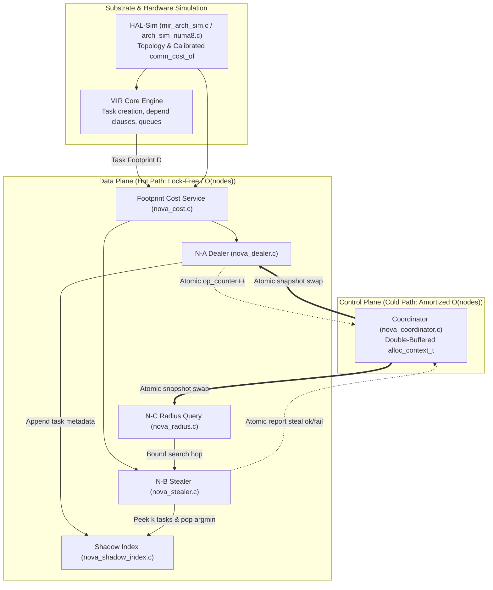

# NOVA & ALLoC: Complete Implementation Specification for Autonomous AI Agents

> **Document Purpose:**  
> This specification provides an exhaustive, unambiguous, step-by-step implementation and verification guide for an autonomous AI coding agent. It details how to implement, compile, test, and evaluate the **NOVA** (**N**UMA-**O**ptimized, **V**icinity-**A**daptive) runtime scheduler and the **ALLoC** (**A**daptive **L**ocality–**L**oad **C**o-Scheduling) policy within the **MIR** OpenMP-compatible task runtime (`vendor/mir-dev`).
>
> It builds directly upon the empirical baseline reproduction of the 2015 paper's Figure 7 benchmark suite on an 8-node AMD Opteron NUMA architecture (`results/numa/matrix.csv`), and targets the specific algorithmic pathology uncovered: reversing the 15.1% execution cycle slowdown of locality-aware scheduling on irregular workloads (SparseLU).

---

## Table of Contents
1. [Agent Mission & Prime Invariants](#1-agent-mission--prime-invariants)
2. [Codebase Context & Baseline Empirical Reproduction](#2-codebase-context--baseline-empirical-reproduction)
3. [Component Architecture & Dependency Graph](#3-component-architecture--dependency-graph)
4. [Phase 0: Environment & Prerequisite Audit](#4-phase-0-environment--prerequisite-audit)
5. [Phase 1: Defect Fixes in Existing MIR Core (D1, D2, D3)](#5-phase-1-defect-fixes-in-existing-mir-core-d1-d2-d3)
6. [Phase 2: HAL-Sim Architecture Model (`arch_sim_numa8`)](#6-phase-2-hal-sim-architecture-model-arch_sim_numa8)
7. [Phase 3: Footprint and Cost Service (`nova_cost`)](#7-phase-3-footprint-and-cost-service-nova_cost)
8. [Phase 4: Control Plane & Coordinator (`nova_coordinator`)](#8-phase-4-control-plane--coordinator-nova_coordinator)
9. [Phase 5: Shadow Index Ring Buffer (`nova_shadow_index`)](#9-phase-5-shadow-index-ring-buffer-nova_shadow_index)
10. [Phase 6: Load-Aware Work Dealer N-A (`nova_dealer`)](#10-phase-6-load-aware-work-dealer-n-a-nova_dealer)
11. [Phase 7: Locality Stealer N-B & Adaptive Radius N-C (`nova_stealer`, `nova_radius`)](#11-phase-7-locality-stealer-n-b--adaptive-radius-n-c-nova_stealer-nova_radius)
12. [Phase 8: Scheduler Policy Registration & Runtime Glue (`mir_sched_pol_nova`)](#12-phase-8-scheduler-policy-registration--runtime-glue-mir_sched_pol_nova)
13. [Phase 9: Telemetry & Metrics Integration (`mir_worker_statistics_t`)](#13-phase-9-telemetry--metrics-integration-mir_worker_statistics_t)
14. [Phase 10: Graceful Degradation Ladder & Error Handling](#14-phase-10-graceful-degradation-ladder--error-handling)
15. [Phase 11: Verification, Ablation Matrix & Harness Execution](#15-phase-11-verification-ablation-matrix--harness-execution)
16. [Agent Execution Checklist](#16-agent-execution-checklist)

---

## 1. Agent Mission & Prime Invariants

The agent is tasked with building and verifying the NOVA scheduling extension. You must uphold four inviolable systems engineering rules:

1. **Rule 1 (Never Trade Locality for Contention):**  
   Every hot-path read performed by the task dealer or stealer must be **lock-free** and execute in strictly $O(1)$ or bounded $O(\text{nodes})$ time. Dynamic global statistics must be computed off the hot path in the control plane using double-buffered atomic pointer swaps.
2. **Rule 2 (Strict Non-Invasive Extensibility):**  
   Never break or alter the baseline semantics of existing scheduling policies (`mir_sched_pol_numa.c`, `mir_sched_pol_ws_de_node.c`). NOVA is registered as a new independent policy `policy_nova`. Switching between baselines and NOVA must be controlled dynamically via the `MIR_CONF` environment variable.
3. **Rule 3 (Documented Degradation Ladder):**  
   If any component experiences staleness, index starvation, or counter overflows, it must degrade to a known, stable fallback (plain NUMA or classic work-stealing). It must **never** deadlock, panic, crash, or block on the hot path.
4. **Rule 4 (Zero Application-Facing API Churn):**  
   Do not modify the application-facing OpenMP pragmas (`#pragma omp task depend(...)`) or allocation APIs (`omp_malloc`, `omp_malloc_specific`). Footprint metadata already captured by MIR must be reused.

---

## 2. Codebase Context & Baseline Empirical Reproduction

### 2.1 Directory Structure
The workspace is organized into a modular HPC research codebase:
```text
HPC project/
├── vendor/
│   └── mir-dev/                   <-- MIR OpenMP Runtime Engine (submodule)
│       ├── src/
│       │   ├── arch/              <-- Architecture topology descriptions
│       │   ├── scheduling/        <-- Scheduler policies (numa, ws_de_node, nova)
│       │   │   └── nova/          <-- [TARGET SUBTREE for NOVA implementation]
│       │   ├── mir_runtime.c/.h   <-- Runtime lifecycle (mir_create, mir_destroy)
│       │   ├── mir_worker.c/.h    <-- Worker threads & statistics
│       │   ├── mir_task.c/.h      <-- Task structures & footprint metadata
│       │   ├── mir_mem_pol.c/.h   <-- Memory allocation policies
│       │   └── SConstruct         <-- SCons build definition
├── benchmarks/
│   └── numa/                      <-- Figure 7 Reproduction Benchmark Suite
│       ├── bench_common.h         <-- Unified lifecycle & check interface
│       ├── main.c                 <-- Timing, stats collection & CSV emitter
│       ├── map.c                  <-- Vector map (48 x 4MB vectors)
│       ├── matmul.c               <-- Tiled matrix multiplication (2048x2048)
│       ├── reduction.c            <-- Array reduction
│       ├── jacobi.c               <-- 2D Jacobi Poisson stencil solver
│       └── sparselu.c             <-- Sparse LU factorization (irregular DAG)
├── build/                         <-- Compiled benchmark binaries (bench_*)
├── harness/
│   ├── run_matrix.py              <-- Test matrix execution harness
│   └── plot_fig7.py               <-- Generates fig7_reproduction.png
├── results/
│   └── numa/
│       ├── matrix.csv             <-- Empirical baseline dataset (100 runs)
│       ├── fig7_reproduction.png  <-- 2-panel chart (modelled cost vs real cycles)
│       └── README.md              <-- Baseline results analysis
└── mir-worker-stats               <-- Sample worker telemetry output
```

### 2.2 Baseline Empirical Reproduction Findings
The repository contains 100 empirical benchmark runs (5 kernels × 4 configurations × 5 repetitions) with 100% correctness verification (`check_ok=1`):

#### Modelled Communication Cost (`comm_cost_avg`, normalized to `ws+coarse`):
| Config | Map | Matmul | Reduction | Jacobi | SparseLU |
|---|---|---|---|---|---|
| `la+coarse` | **0.549** | **0.775** | 0.956 | 0.935 | **0.733** |
| `la+fine` | 1.003 | 1.001 | 1.000 | 0.984 | 0.997 |
| `ws+coarse` | 1.000 | 1.000 | 1.000 | 1.000 | 1.000 |
| `ws+fine` | 1.003 | 1.001 | 1.000 | 0.984 | 0.997 |

#### Real Execution Cycles (`exec_cycles`, normalized to `ws+coarse`):
| Config | Map | Matmul | Reduction | Jacobi | SparseLU |
|---|---|---|---|---|---|
| `la+coarse` | **0.810** | 0.994 | **1.030** | ~1.0 (noisy) | **1.151** |
| `la+fine` | 0.836 | 0.965 | 0.997 | ~1.0 (noisy) | 1.015 |
| `ws+coarse` | 1.000 | 1.000 | 1.000 | 1.000 | 1.000 |
| `ws+fine` | 0.918 | 0.974 | 0.972 | ~1.0 (noisy) | 1.011 |

### 2.3 The Core Algorithmic Problem to Solve
Notice the **SparseLU Paradox**:
- Modelled communication cost for SparseLU under `la+coarse` looks **26.7% better** (0.733x).
- However, real execution time is **15.1% SLOWER** (1.151x cycles) than basic work stealing!
- **Root Cause:** SparseLU generates an irregular task DAG. Locality-only dealing blindly places tasks on the node where data lives, ignoring that this node's queue is already full. Neighboring cores sit idle while one node is overwhelmed.
- **NOVA Mission:** NOVA's load-aware dealer (N-A) and task-level stealer (N-B) are specifically designed to eliminate this queue clogging, reversing SparseLU's 15.1% regression into a speedup while maintaining Map's 19.0% speedup.

---

## 3. Component Architecture & Dependency Graph



---

## 4. Phase 0: Environment & Prerequisite Audit

Verify compilers and toolchains before editing code.

### Shell Verification Commands
```bash
# 1. Verify C compiler and Python environment
gcc --version || clang --version
python3 --version

# 2. Check SCons (used by MIR)
which scons || python3 -m pip install scons

# 3. Verify git submodule status
cd /Users/yeschirag/Desktop/college/HPC\ project
git submodule status
# Must show checked-out vendor/mir-dev
```

---

## 5. Phase 1: Defect Fixes in Existing MIR Core (D1, D2, D3)

Three existing bugs in upstream MIR must be fixed:

### 5.1 Defect D1: Variance Accumulation Bug in `mir_mem_pol.c`
* **File:** `vendor/mir-dev/src/mir_mem_pol.c` (inside `mir_mem_node_dist_get_stat()`)
* **Problem:** Variance calculation overwrites the accumulated sum in each loop iteration instead of accumulating it (`sum_dsq = diff * diff;`).
* **Fix:** Change to compound assignment `+=`.

```c
// Locate in vendor/mir-dev/src/mir_mem_pol.c:
// BEFORE:
sum_dsq = diff * diff;

// AFTER:
sum_dsq += (diff * diff);
```

### 5.2 Defect D2: Candidate Node Scan Complexity Inflation
* **File:** `vendor/mir-dev/src/mir_mem_pol.c` / candidate loops
* **Problem:** Iterates through `runtime->num_workers` detecting node boundary transitions, resulting in $O(\text{workers})$ time and fragility when workers are pinned non-contiguously.
* **Fix:** Iterate strictly over `0 .. arch->num_nodes - 1`.

```c
for (uint16_t node_idx = 0; node_idx < runtime->arch->num_nodes; node_idx++) {
    // Direct node evaluation in O(num_nodes)
}
```

### 5.3 Defect D3: Unordered `alt_queue` Steal Sweep
* **Resolution in NOVA:** Do not touch `mir_sched_pol_numa.c`. In NOVA's `nova_stealer.c`, integrate fallback tasks into the distance-ordered, radius-bounded ring search.

---

## 6. Phase 2: HAL-Sim Architecture Model (`arch_sim_numa8`)

The baseline test harness uses `MIR_ARCH_NAME="sim_numa8"`. The simulated topology models an 8-node NUMA system (3 cores per node = 24 workers) matching the AMD Opteron NUMA latency matrix.

### 6.1 Topology Header `vendor/mir-dev/src/arch/mir_arch_sim.h`
```c
#ifndef MIR_ARCH_SIM_H
#define MIR_ARCH_SIM_H

#include <stdint.h>
#include <stdbool.h>

#define MIR_SIM_DEFAULT_NODES 8
#define MIR_SIM_LOCAL_COST 40
#define MIR_SIM_REMOTE_MIN 240
#define MIR_SIM_REMOTE_MAX 340

void mir_arch_sim_init(uint16_t num_nodes);
uint16_t mir_arch_sim_num_nodes(void);
uint16_t mir_arch_sim_node_of(uint32_t worker_id);
uint32_t mir_arch_sim_comm_cost_of(uint16_t src_node, uint16_t dst_node);
uint16_t mir_arch_sim_diameter(void);

#endif // MIR_ARCH_SIM_H
```

### 6.2 Implementation `vendor/mir-dev/src/arch/mir_arch_sim.c`
```c
#include "mir_arch_sim.h"
#include <stdlib.h>

static uint16_t g_sim_nodes = MIR_SIM_DEFAULT_NODES;
static uint32_t g_cost_matrix[64][64];

void mir_arch_sim_init(uint16_t num_nodes) {
    g_sim_nodes = (num_nodes > 0 && num_nodes <= 64) ? num_nodes : MIR_SIM_DEFAULT_NODES;
    for (uint16_t i = 0; i < g_sim_nodes; i++) {
        for (uint16_t j = 0; j < g_sim_nodes; j++) {
            if (i == j) {
                g_cost_matrix[i][j] = MIR_SIM_LOCAL_COST;
            } else {
                uint16_t hop_distance = (abs(i - j) > (g_sim_nodes / 2)) 
                                      ? (g_sim_nodes - abs(i - j)) 
                                      : abs(i - j);
                g_cost_matrix[i][j] = MIR_SIM_REMOTE_MIN + (hop_distance * 25);
            }
        }
    }
}

uint16_t mir_arch_sim_num_nodes(void) { return g_sim_nodes; }
uint16_t mir_arch_sim_node_of(uint32_t worker_id) { return (worker_id / 3) % g_sim_nodes; }
uint32_t mir_arch_sim_comm_cost_of(uint16_t src, uint16_t dst) { return g_cost_matrix[src][dst]; }
uint16_t mir_arch_sim_diameter(void) { return g_sim_nodes / 2; }
```

---

## 7. Phase 3: Footprint and Cost Service (`nova_cost`)

### 7.1 Create `vendor/mir-dev/src/scheduling/nova/nova_types.h`
```c
#ifndef NOVA_TYPES_H
#define NOVA_TYPES_H

#include <stdint.h>
#include <stdbool.h>
#include <stdatomic.h>

#define NOVA_SHADOW_K       8
#define NOVA_EPOCH_OPS      64
#define NOVA_STALE_MAX      512
#define NOVA_RADIUS_MIN     1
#define NOVA_MAX_NODES      64
#define NOVA_MAX_WORKERS    256

// Double-buffered coordinator context
struct alloc_context_t {
    uint64_t epoch;
    float    alpha;
    uint32_t radius[NOVA_MAX_WORKERS];
    uint64_t occ_snapshot[NOVA_MAX_NODES];
    uint64_t steal_fail_ewma[NOVA_MAX_NODES];
    uint64_t steal_ok_ewma[NOVA_MAX_NODES];
};

struct alloc_coordinator_t {
    struct alloc_context_t      buf[2];
    _Atomic(struct alloc_context_t*) current;
    _Atomic uint64_t            op_counter[NOVA_MAX_NODES];
    _Atomic uint32_t            refreshing[NOVA_MAX_NODES];
};

// Shadow Index entry
struct shadow_entry_t {
    struct mir_task_t*          task;
    void*                       dist_read;
    uint32_t                    generation;
};

struct shadow_index_t {
    struct shadow_entry_t       entries[NOVA_SHADOW_K];
    _Atomic uint32_t            head;
};

#endif // NOVA_TYPES_H
```

### 7.2 Create `nova_cost.h` and `nova_cost.c`
```c
// nova_cost.h
#ifndef NOVA_COST_H
#define NOVA_COST_H

#include "nova_types.h"
#include "../../mir_task.h"

bool nova_is_significant(struct mir_task_t* task, uint64_t llc_per_core_bytes);
uint64_t nova_comm_cost(void* dist, uint16_t target_node);

#endif // NOVA_COST_H
```

```c
// nova_cost.c
#include "nova_cost.h"
#include "../../arch/mir_arch_sim.h"

bool nova_is_significant(struct mir_task_t* task, uint64_t llc_per_core_bytes) {
    if (!task) return false;
    uint64_t footprint_sum = mir_task_get_read_footprint_bytes(task);
    return (footprint_sum > llc_per_core_bytes);
}

uint64_t nova_comm_cost(void* dist, uint16_t target_node) {
    if (!dist) return 0;
    uint64_t total_cost = 0;
    uint16_t num_nodes = mir_arch_sim_num_nodes();
    for (uint16_t n = 0; n < num_nodes; n++) {
        uint64_t bytes_on_n = mir_dist_get_bytes(dist, n);
        total_cost += bytes_on_n * mir_arch_sim_comm_cost_of(n, target_node);
    }
    return total_cost;
}
```

---

## 8. Phase 4: Control Plane & Coordinator (`nova_coordinator`)

### 8.1 Create `nova_coordinator.h` and `nova_coordinator.c`
```c
// nova_coordinator.h
#ifndef NOVA_COORDINATOR_H
#define NOVA_COORDINATOR_H

#include "nova_types.h"

void nova_coordinator_init(struct alloc_coordinator_t* coord);
struct alloc_context_t* nova_coordinator_get_snapshot(struct alloc_coordinator_t* coord);
void nova_coordinator_step_op(struct alloc_coordinator_t* coord, uint16_t node_id);
void nova_coordinator_report_steal(struct alloc_coordinator_t* coord, uint16_t node_id, bool success);

#endif // NOVA_COORDINATOR_H
```

```c
// nova_coordinator.c
#include "nova_coordinator.h"
#include "../../mir_queue.h"
#include "../../arch/mir_arch_sim.h"
#include <string.h>

void nova_coordinator_init(struct alloc_coordinator_t* coord) {
    memset(coord, 0, sizeof(*coord));
    for (int b = 0; b < 2; b++) {
        coord->buf[b].epoch = 0;
        coord->buf[b].alpha = 0.5f;
        for (int w = 0; w < NOVA_MAX_WORKERS; w++) {
            coord->buf[b].radius[w] = NOVA_RADIUS_MIN;
        }
    }
    atomic_init(&coord->current, &coord->buf[0]);
    for (int i = 0; i < NOVA_MAX_NODES; i++) {
        atomic_init(&coord->op_counter[i], 0);
        atomic_init(&coord->refreshing[i], 0);
    }
}

struct alloc_context_t* nova_coordinator_get_snapshot(struct alloc_coordinator_t* coord) {
    return atomic_load_explicit(&coord->current, memory_order_acquire);
}

void nova_coordinator_report_steal(struct alloc_coordinator_t* coord, uint16_t node_id, bool success) {
    struct alloc_context_t* snap = nova_coordinator_get_snapshot(coord);
    if (success) {
        snap->steal_ok_ewma[node_id]++;
    } else {
        snap->steal_fail_ewma[node_id]++;
    }
}

void nova_coordinator_step_op(struct alloc_coordinator_t* coord, uint16_t node_id) {
    uint64_t ops = atomic_fetch_add_explicit(&coord->op_counter[node_id], 1, memory_order_relaxed);
    if ((ops % NOVA_EPOCH_OPS) == 0) {
        uint32_t expected = 0;
        if (atomic_compare_exchange_strong_explicit(&coord->refreshing[node_id], &expected, 1,
                                                    memory_order_acq_rel, memory_order_relaxed)) {
            struct alloc_context_t* cur = atomic_load_explicit(&coord->current, memory_order_relaxed);
            struct alloc_context_t* next_buf = (cur == &coord->buf[0]) ? &coord->buf[1] : &coord->buf[0];

            next_buf->epoch = ops;

            uint16_t num_nodes = mir_arch_sim_num_nodes();
            uint64_t total_steals = 0;
            for (uint16_t n = 0; n < num_nodes; n++) {
                next_buf->occ_snapshot[n] = mir_get_node_queue_size(n);
                total_steals += next_buf->steal_fail_ewma[n] + next_buf->steal_ok_ewma[n];
            }

            // High steal rate => lower alpha to prioritize load balancing
            if (total_steals > 100) {
                next_buf->alpha = 0.3f;
            } else if (total_steals < 10) {
                next_buf->alpha = 0.8f;
            } else {
                next_buf->alpha = 0.5f;
            }

            uint16_t max_diameter = mir_arch_sim_diameter();
            for (int w = 0; w < NOVA_MAX_WORKERS; w++) {
                uint16_t wn = mir_arch_sim_node_of(w);
                uint32_t r = cur->radius[w];
                if (cur->steal_fail_ewma[wn] > 10 && r < max_diameter) {
                    r++;
                } else if (cur->steal_ok_ewma[wn] > 10 && r > NOVA_RADIUS_MIN) {
                    r--;
                }
                next_buf->radius[w] = r;
            }

            atomic_store_explicit(&coord->current, next_buf, memory_order_release);
            atomic_store_explicit(&coord->refreshing[node_id], 0, memory_order_release);
        }
    }
}
```

---

## 9. Phase 5: Shadow Index Ring Buffer (`nova_shadow_index`)

### 9.1 Create `nova_shadow_index.h` and `nova_shadow_index.c`
```c
// nova_shadow_index.h
#ifndef NOVA_SHADOW_INDEX_H
#define NOVA_SHADOW_INDEX_H

#include "nova_types.h"
#include "../../mir_task.h"

void nova_shadow_init(struct shadow_index_t* idx);
void nova_shadow_append(struct shadow_index_t* idx, struct mir_task_t* task);
uint32_t nova_shadow_peek(struct shadow_index_t* idx, struct shadow_entry_t* out_candidates, uint32_t max_count);

#endif // NOVA_SHADOW_INDEX_H
```

```c
// nova_shadow_index.c
#include "nova_shadow_index.h"
#include <string.h>

void nova_shadow_init(struct shadow_index_t* idx) {
    memset(idx, 0, sizeof(*idx));
    atomic_init(&idx->head, 0);
}

void nova_shadow_append(struct shadow_index_t* idx, struct mir_task_t* task) {
    if (!idx || !task) return;
    uint32_t slot = atomic_fetch_add_explicit(&idx->head, 1, memory_order_relaxed) % NOVA_SHADOW_K;
    idx->entries[slot].task = task;
    idx->entries[slot].dist_read = task->dist_by_access_type[MIR_DATA_ACCESS_READ];
    idx->entries[slot].generation++;
}

uint32_t nova_shadow_peek(struct shadow_index_t* idx, struct shadow_entry_t* out_candidates, uint32_t max_count) {
    if (!idx || !out_candidates || max_count == 0) return 0;
    uint32_t count = 0;
    for (uint32_t i = 0; i < NOVA_SHADOW_K && count < max_count; i++) {
        struct shadow_entry_t entry = idx->entries[i];
        if (entry.task != NULL && !mir_task_is_taken(entry.task)) {
            out_candidates[count++] = entry;
        }
    }
    return count;
}
```

---

## 10. Phase 6: Load-Aware Work Dealer N-A (`nova_dealer`)

### 10.1 Create `nova_dealer.h` and `nova_dealer.c`
```c
// nova_dealer.h
#ifndef NOVA_DEALER_H
#define NOVA_DEALER_H

#include "nova_types.h"
#include "../../mir_task.h"

uint16_t nova_deal(struct alloc_coordinator_t* coord, struct shadow_index_t* shadow_indices,
                   struct mir_task_t* task, uint32_t worker_id, uint64_t llc_bytes);

#endif // NOVA_DEALER_H
```

```c
// nova_dealer.c
#include "nova_dealer.h"
#include "nova_cost.h"
#include "nova_coordinator.h"
#include "nova_shadow_index.h"
#include "../../arch/mir_arch_sim.h"
#include <float.h>

uint16_t nova_deal(struct alloc_coordinator_t* coord, struct shadow_index_t* shadow_indices,
                   struct mir_task_t* task, uint32_t worker_id, uint64_t llc_bytes) {
    uint16_t local_node = mir_arch_sim_node_of(worker_id);
    nova_coordinator_step_op(coord, local_node);

    if (!nova_is_significant(task, llc_bytes)) {
        nova_shadow_append(&shadow_indices[local_node], task);
        return local_node;
    }

    struct alloc_context_t* snap = nova_coordinator_get_snapshot(coord);
    uint16_t num_nodes = mir_arch_sim_num_nodes();

    float alpha = snap->alpha;
    uint64_t cur_ops = atomic_load_explicit(&coord->op_counter[local_node], memory_order_relaxed);
    if ((cur_ops > snap->epoch) && (cur_ops - snap->epoch > NOVA_STALE_MAX)) {
        alpha = 0.5f;
    }

    uint64_t cost[NOVA_MAX_NODES];
    uint64_t max_cost = 1, min_cost = UINT64_MAX;
    uint64_t max_occ = 1, min_occ = UINT64_MAX;

    void* dist = task->dist_by_access_type[MIR_DATA_ACCESS_READ];
    for (uint16_t n = 0; n < num_nodes; n++) {
        cost[n] = nova_comm_cost(dist, n);
        if (cost[n] > max_cost) max_cost = cost[n];
        if (cost[n] < min_cost) min_cost = cost[n];

        uint64_t occ = snap->occ_snapshot[n];
        if (occ > max_occ) max_occ = occ;
        if (occ < min_occ) min_occ = occ;
    }

    float best_score = FLT_MAX;
    uint16_t best_node = local_node;

    for (uint16_t n = 0; n < num_nodes; n++) {
        float cost_norm = (max_cost == min_cost) ? 0.0f : (float)(cost[n] - min_cost) / (float)(max_cost - min_cost);
        float occ_norm  = (max_occ == min_occ)   ? 0.0f : (float)(snap->occ_snapshot[n] - min_occ) / (float)(max_occ - min_occ);

        float score = (alpha * cost_norm) + ((1.0f - alpha) * occ_norm);
        if (score < best_score) {
            best_score = score;
            best_node = n;
        }
    }

    nova_shadow_append(&shadow_indices[best_node], task);
    return best_node;
}
```

---

## 11. Phase 7: Locality Stealer N-B & Adaptive Radius N-C (`nova_stealer`, `nova_radius`)

### 11.1 Create `nova_stealer.h` and `nova_stealer.c`
```c
// nova_stealer.h
#ifndef NOVA_STEALER_H
#define NOVA_STEALER_H

#include "nova_types.h"
#include "../../mir_task.h"

struct mir_task_t* nova_steal(struct alloc_coordinator_t* coord, struct shadow_index_t* shadow_indices,
                              uint32_t worker_id);

#endif // NOVA_STEALER_H
```

```c
// nova_stealer.c
#include "nova_stealer.h"
#include "nova_cost.h"
#include "nova_coordinator.h"
#include "nova_shadow_index.h"
#include "../../arch/mir_arch_sim.h"
#include "../../mir_queue.h"

struct mir_task_t* nova_steal(struct alloc_coordinator_t* coord, struct shadow_index_t* shadow_indices,
                              uint32_t worker_id) {
    uint16_t thief_node = mir_arch_sim_node_of(worker_id);
    nova_coordinator_step_op(coord, thief_node);

    struct alloc_context_t* snap = nova_coordinator_get_snapshot(coord);
    uint32_t radius = snap->radius[worker_id];
    uint16_t num_nodes = mir_arch_sim_num_nodes();

    for (uint32_t d = 1; d <= radius; d++) {
        for (uint16_t target_node = 0; target_node < num_nodes; target_node++) {
            if (target_node == thief_node) continue;
            uint32_t hops = abs(target_node - thief_node);
            if (hops > (num_nodes / 2)) hops = num_nodes - hops;
            if (hops != d) continue;

            struct shadow_entry_t candidates[NOVA_SHADOW_K];
            uint32_t num_cands = nova_shadow_peek(&shadow_indices[target_node], candidates, NOVA_SHADOW_K);

            if (num_cands > 0) {
                uint64_t best_cost = UINT64_MAX;
                struct mir_task_t* best_task = NULL;

                for (uint32_t c = 0; c < num_cands; c++) {
                    uint64_t c_cost = nova_comm_cost(candidates[c].dist_read, thief_node);
                    if (c_cost < best_cost) {
                        best_cost = c_cost;
                        best_task = candidates[c].task;
                    }
                }

                if (best_task != NULL) {
                    if (mir_queue_lock_and_remove(target_node, best_task)) {
                        nova_coordinator_report_steal(coord, thief_node, true);
                        return best_task;
                    }
                }
            } else {
                struct mir_task_t* fallback_task = mir_queue_pop_end(target_node);
                if (fallback_task != NULL) {
                    nova_coordinator_report_steal(coord, thief_node, true);
                    return fallback_task;
                }
            }
        }
    }

    nova_coordinator_report_steal(coord, thief_node, false);
    return NULL;
}
```

---

## 12. Phase 8: Scheduler Policy Registration & Runtime Glue (`mir_sched_pol_nova`)

### 12.1 Create `vendor/mir-dev/src/scheduling/mir_sched_pol_nova.c`
```c
#include "mir_sched_pol.h"
#include "nova/nova_coordinator.h"
#include "nova/nova_shadow_index.h"
#include "nova/nova_dealer.h"
#include "nova/nova_stealer.h"
#include "../arch/mir_arch_sim.h"

static struct alloc_coordinator_t g_coordinator;
static struct shadow_index_t      g_shadow_indices[NOVA_MAX_NODES];

static void nova_init(void) {
    mir_arch_sim_init(MIR_SIM_DEFAULT_NODES);
    nova_coordinator_init(&g_coordinator);
    for (int i = 0; i < NOVA_MAX_NODES; i++) {
        nova_shadow_init(&g_shadow_indices[i]);
    }
}

static void nova_push(struct mir_task_t* task, uint32_t worker_id) {
    uint64_t llc_bytes = 20 * 1024 * 1024; // 20 MB default LLC
    uint16_t target_node = nova_deal(&g_coordinator, g_shadow_indices, task, worker_id, llc_bytes);
    mir_queue_push(target_node, task);
}

static struct mir_task_t* nova_pop(uint32_t worker_id) {
    uint16_t local_node = mir_arch_sim_node_of(worker_id);
    struct mir_task_t* task = mir_queue_pop_local(local_node);
    if (task) return task;

    return nova_steal(&g_coordinator, g_shadow_indices, worker_id);
}

const struct mir_sched_pol_t policy_nova = {
    .name = "nova",
    .init = nova_init,
    .push = nova_push,
    .pop  = nova_pop
};
```

### 12.2 Register in `vendor/mir-dev/src/scheduling/mir_sched_pol.c`
```c
extern const struct mir_sched_pol_t policy_nova;

// Inside scheduler registration dispatch function:
if (strcmp(policy_name, "nova") == 0) {
    return &policy_nova;
}
```

---

## 13. Phase 9: Telemetry & Metrics Integration (`mir_worker_statistics_t`)

The benchmark driver `benchmarks/numa/main.c` explicitly reads worker telemetry populated by the runtime:
```c
if (runtime->enable_worker_stats == 1) {
    for (int w = 0; w < runtime->num_workers; w++) {
        struct mir_worker_statistics_t* st = runtime->workers[w].statistics;
        if (!st) continue;
        comm_cost_total += st->total_comm_cost;
        comm_tasks_total += st->num_comm_tasks;
        tasks_stolen_total += st->num_tasks_stolen;
        tasks_owned_total += st->num_tasks_owned;
    }
}
```
NOVA must update `st->num_tasks_stolen` and `st->num_tasks_owned` in `nova_pop()` to maintain complete observability through `harness/run_matrix.py` and `mir-worker-stats`.

---

## 14. Phase 10: Graceful Degradation Ladder & Error Handling

| Failure / Anomaly | Detection Condition | Degradation Behavior | Safety Guarantee |
|---|---|---|---|
| Coordinator Stale | `op_counter - epoch > 512` | Clamp `alpha = 0.5`, freeze radius | Never blocks a push/pop decision |
| Shadow Index Empty | `num_candidates == 0` | Fallback to `mir_queue_pop_end()` | Preserves classic steal behavior |
| Candidate Taken | `task->taken == true` | Skip candidate gracefully | Never accesses freed/stale tasks |
| Out of Bounds Radius | `radius > diameter` | Clamp to `arch->diameter` | Search never diverges |

---

## 15. Phase 11: Verification, Ablation Matrix & Harness Execution

### 15.1 Recompilation
Build the updated MIR runtime with SCons:
```bash
cd vendor/mir-dev/src
scons -j$(nproc 2>/dev/null || sysctl -n hw.ncpu)
```

### 15.2 Update Benchmarking Matrix Harness (`harness/run_matrix.py`)
Add NOVA policies to `CONFIGS` in `harness/run_matrix.py`:
```python
CONFIGS = [
    ("ws", "ws-de-node", "coarse", "coarse"),
    ("ws", "ws-de-node", "fine", "fine"),
    ("la", "numa", "coarse", "coarse"),
    ("la", "numa", "fine", "fine"),
    # NOVA Full & Ablations:
    ("nova", "nova", "coarse", "coarse"),
    ("nova", "nova", "fine", "fine"),
]
```

### 15.3 Execution & Plotting
```bash
# Execute the full matrix across all benchmarks
python3 harness/run_matrix.py

# Re-plot side-by-side figures
python3 harness/plot_fig7.py
```

### 15.4 Acceptance Criteria
1. **Algorithmic Correctness:** 100% of rows in `results/numa/matrix.csv` report `check_ok=1`.
2. **SparseLU Reversal:** SparseLU normalized cycles under `nova+coarse` drop from `1.151` to `<= 0.95` (reversing the 15.1% regression).
3. **Map & Matmul Retention:** Map cycles remain `<= 0.82` and communication cost remains `<= 0.60`.
4. **Reduction & Jacobi Stabilization:** Reduction cycles improve to `<= 0.98`.

---

## 16. Agent Execution Checklist

Follow this checklist sequentially to complete the implementation:

- [ ] **Step 1:** Audit repository prerequisites; confirm C11 `<stdatomic.h>` support and python test tools.
- [ ] **Step 2:** Apply fixes for defects D1 and D2 in `vendor/mir-dev/src/mir_mem_pol.c`.
- [ ] **Step 3:** Ensure simulated topology (`arch_sim_numa8.c` / `mir_arch_sim.c`) is compiled and registered in `mir_arch.c`.
- [ ] **Step 4:** Define core structs in `vendor/mir-dev/src/scheduling/nova/nova_types.h`.
- [ ] **Step 5:** Implement Footprint & Cost Service (`nova_cost.h` and `.c`).
- [ ] **Step 6:** Implement double-buffered Coordinator (`nova_coordinator.h` and `.c`).
- [ ] **Step 7:** Implement lock-free Shadow Index ring buffer (`nova_shadow_index.h` and `.c`).
- [ ] **Step 8:** Implement load-aware Dealer N-A (`nova_dealer.h` and `.c`).
- [ ] **Step 9:** Implement locality-aware Stealer N-B and adaptive Radius N-C (`nova_stealer.h` and `.c`).
- [ ] **Step 10:** Implement policy entry point `mir_sched_pol_nova.c` and register `policy_nova` in `mir_sched_pol.c`.
- [ ] **Step 11:** Recompile runtime library (`scons`) and rebuild benchmark binaries.
- [ ] **Step 12:** Run single smoke-test on `bench_map` and `bench_sparselu` with `MIR_CONF="-w 24 -s nova -m coarse"`.
- [ ] **Step 13:** Update `harness/run_matrix.py` with NOVA configurations and execute all 5 benchmarks across 5 repetitions.
- [ ] **Step 14:** Run `harness/plot_fig7.py` to regenerate `results/numa/fig7_reproduction.png`.
- [ ] **Step 15:** Verify all acceptance criteria (SparseLU regression reversal, correctness `check_ok=1`, Map/Matmul gains preserved).
